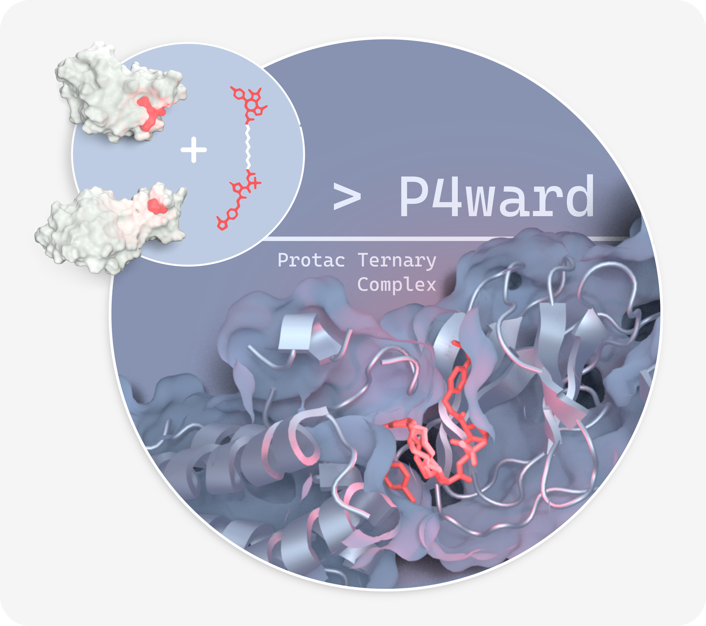

  

# P4ward - Predictive Python Protacs Pipeline: workflow automation for research and development.

P4ward is a fully automated, customizable and open-source program for Protacs ternary complex modelling. P4ward takes two binary complexes, as well as a list of Protac 2D structures, and models ternary complexes for each of the protacs. P4ward also generates summary tables with all relevand modelling information, as well as interactive plots.

P4ward is written in Python3 and integrates free and open-source structural biology tools, such as Megadock, RxDock, and libraries such as RDkit and BioPython to build a workflow with no accessibility barriers. As such, we acknowledge the countless contributors to open-source code which enables research by all and for all (Please view [this section](https://github.com/SKTeamLab/P4ward?tab=readme-ov-file#third-party-attributions-and-licenses) for attribution and licenses).

Please visit our [documentation page](https://skteamlab.github.io/P4ward/) for more information on:
- How to obtain P4ward
- How to run P4ward
- Detailed description of how P4ward works.

Please refer to [P4ward's preprint](https://www.biorxiv.org/content/10.1101/2024.11.28.625921v1) for:
- Description of P4ward's workflow
- Detailed description of the P4ward's benchmarking and validation.

> [!NOTE]  
> If you use P4ward on your research, please acknowledge this work and cite:
>  P4ward: an automated modelling platformfor Protac ternary complexes. Paula Jofily, Subha Kalyaanamoorthy. bioRxiv 2024.11.28.625921; doi: https://doi.org/10.1101/2024.11.28.625921 

> [!TIP]
> If you require assistance or have any questions about using P4ward, I am happy to help! Please simply open an issue [here](https://github.com/SKTeamLab/P4ward/issues).

Also, check out my other projects at [PaulaJLR](https://github.com/PaulaJLR) and the lab's other projects at [SKLab](https://github.com/SKTeamLab).

## Third party attributions and licenses

- This project, P4ward, depends on [MEGADOCK](https://github.com/akiyamalab/MEGADOCK), which is licensed under the [Attribution-NonCommercial 4.0 International (CC BY-NC 4.0)](https://github.com/akiyamalab/MEGADOCK?tab=License-1-ov-file). If you use MEGADOCK, you must comply with its non-commercial restriction.
- This project, P4ward, depends on [Open-Source PyMOL](https://github.com/schrodinger/pymol-open-source), which is copyrighted by Schrödinger, LLC, and is made available under its open-source license. For details, see the [Open-Source PyMOL Copyright Notice](https://github.com/schrodinger/pymol-open-source?tab=License-1-ov-file).
- See `dockerfiles/conda_requirements.txt` for complete package attributions.
- The Docker image provided contains third-party software ([MEGADOCK](https://github.com/akiyamalab/MEGADOCK)) licensed under [CC BY-NC 4.0](https://github.com/akiyamalab/MEGADOCK?tab=License-1-ov-file). Users must comply with the licensing terms of MEGADOCK, which prohibits commercial use.
