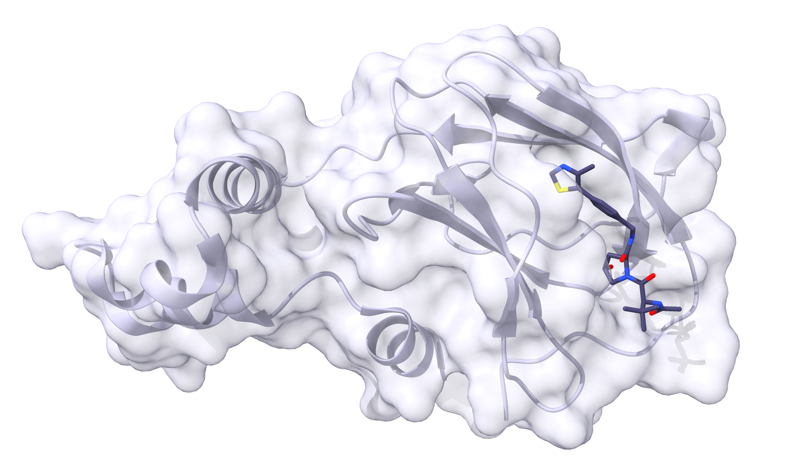
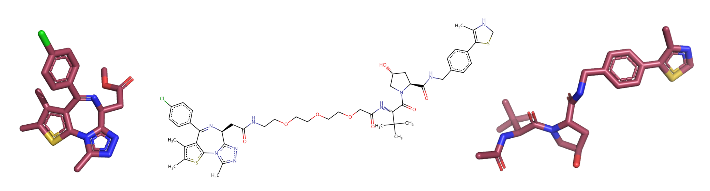
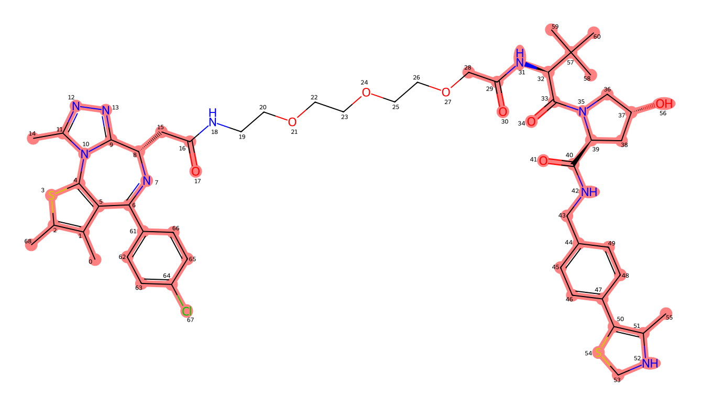

Tutorial
========

In this tutorial, we will obtain two binary complexes from the PDB, and model a Protac ternary complex (TC) with them. All input files and summary files can be found in the tutorial folder in the `GitHub repo <https://example.com>`_.
We will replicate the first ever TC determined experimentally, which comprises the protein of interest (POI) BRD4bd2 bound to the Von Hippel Lindau (VHL) E3 ligase substrate receptor and bridged by the protac MZ1. First, we will run P4ward as if this structure has never been solved at all and make a model of it. Next, we will run P4ward in benchmarking mode, so that we can compare the results with the known crystal structure.

Obtaining the input files
-------------------------

First we need to obtain the files that P4ward needs to run.

- Obtain the binary complex of BRD4bd2 bound to MS417 inhibitor from the PDB, code `6DUV <https://www.rcsb.org/structure/6DUV>`_. We will name this file ``receptor_raw.pdb``
- Obtain the binary of VHL bound to ligand code 3JF, code `4W9H <https://www.rcsb.org/structure/4W9H>`_. This file will be ``ligase_raw.db``
- For each of these binary complexes, we also need to obtain a ``mol2`` file of their respective ligands. Therefore, we can scroll down on their PDB pages and download the instance coordinates for the ligands, choosing mol2 format.
   - For BRD4bd2, download the instance coordinates for the ligand mol2 `here <https://models.rcsb.org/v1/6duv/ligand?auth_seq_id=501&label_asym_id=C&encoding=mol2&filename=6duv_C_0S6.mol2>`_. We will save this file as ``receptor_ligand.mol2``
   - For VHL, find them `here <https://models.rcsb.org/v1/4w9h/ligand?auth_seq_id=301&label_asym_id=M&encoding=mol2&filename=4w9h_M_3JF.mol2>`_. We will save this as ``ligase_ligand.mol2``

Now, we need to clean up the protein files. Using the software of your choice, remove all except the protein's main chain of interest. For example, with ChimeraX we can:

- Delete all nonstandard atoms and redundant chains then save the new structure as ``receptor.pdb``:

.. code-block:: text

   open receptor_raw.pdb
   del ~protein; del ~/A
   save receptor.pdb

- Do the same for the ligase structure:

.. code-block:: text

   open ligase_raw.pdb
   del ~protein; del ~/C
   save ligase.pdb

.. #BDBBD6, #494672

Now, if we open ``receptor.pdb`` with ``receptor_ligand.mol2``, we should see the binary complex:

And we should see the same for ``ligase.pdb`` and ``ligase_ligand.mol2``:

.. image:: ../../tutorial/brd4_binary.png
   :alt: BRD4bd2 binary complex shown by ``receptor.pdb`` and ``receptor_ligand.mol2``
   :width: 400px
   :align: center

Now we can obtain the Protac. P4ward will take a smiles file with one or more smiles code per line. Each line is the code for an entire protac. For now, we can obtain the smiles code for protac MZ1 by copying it from its `PDB page <https://www.rcsb.org/ligand/759>`_ and we can paste it in a file called ``protacs.smiles``. Note that the smiles code can be followed by a single space and the molecule name. This way, the contents of ``protacs.smiles`` will be:

.. code-block:: text

   Cc1c(sc-2c1C(=N[C@H](c3n2c(nn3)C)CC(=O)NCCOCCOCCOCC(=O)N[C@H](C(=O)N4C[C@@H](C[C@H]4C(=O)NCc5ccc(cc5)C6=C(NCS6)C)O)C(C)(C)C)c7ccc(cc7)Cl)C mz1

An important step at this point is to examine the ligand files and the protac 2D structure determined in the smiles code and make sure they match, since P4ward will need to match them later. Bonds in aromatic rings, for example, can be represented in different ways, which could lead to incompatibilities. Visualize your smiles code in a program such as the web version of Marvin sketch, and the ligand files in a program that shows the bond orders, such as Pymol:

All is the same for the receptor ligand, but there are some bond order differences on the receptor ligand. It is important to make sure the smiles contains the correct bond orders. However, it is okay if the ligands in the mol2 files don't, as long as this does not prevent proper matching. This is because only the coordiners of the atoms in the mol2 files will be used for modelling of the protacs later on.

Now we can add to our configuration file the names of the files we just prepared. Open a new file which we will call ``config.ini`` with the following contents:

.. code-block:: ini
   :caption: File: config.ini

   [general]
   receptor = receptor.pdb
   ligase = ligase.pdb
   receptor_ligand = receptor_ligand.mol2
   ligase_ligand = ligase_ligand.mol2
   protacs = protacs.smiles

Checking the protac-ligand matches
----------------------------------

P4ward also offers a simple way to check if the ligands and the protac match. Through its command ``check_lig_matches``, we can see if RDKit will throw any errors about processing the molecules' strucutures, or if it will be able to properly recognize the ligands in the protac structure.
Let's run the ligand check:

.. note::

   When running P4ward through conda, don't forget to activate the conda environment.
   If running through apptainer, don't forget to change the path to the ``.sif`` file when copying the example commands. When using docker, note that ``-v .:/home/data`` should not be changed.

.. tab-set::

    .. tab-item:: Docker

        .. code-block:: bash

            sudo docker run -v .:/home/data p4ward --config_file config.ini --check_lig_matches

    .. tab-item:: Conda

         .. code-block:: bash

            python -m p4ward --config_file config.ini --check_lig_matches

    .. tab-item:: Apptainer

         .. code-block:: bash

            apptainer run -B /home /path/to/p4ward.sif --config_file config.ini --check_lig_matches

P4ward will then run and write a log at ``p4ward.log``:

.. code-block:: console
   :emphasize-lines: 3

   19:13:30 > INFO - Retrieving previous run steps.
   19:13:30 > INFO - No previous data retrieved.
   19:13:30 > ERROR - Ligand matching failed.Please check your structures and consider turning off RDKit ligand sanitization.
   RDKit error:
   Python argument types in
      rdkit.Chem.rdmolops.CombineMols(Mol, NoneType)
   did not match C++ signature:
      CombineMols(RDKit::ROMol mol1, RDKit::ROMol mol2, RDGeom::Point3D offset=<rdkit.Geometry.rdGeometry.Point3D object at 0x7feff2c8adc0>)

We see P4ward warned us that there is an error with the ligands (highlighted line). By default, ligand sanitization is set to ``True`` on in P4ward's settings, so we will add it to our ``config.ini`` file with a value of ``False`` to turn it off:

.. code-block:: ini
   :caption: File: config.ini
   :emphasize-added: 7

   [general]
   receptor = receptor.pdb
   ligase = ligase.pdb
   receptor_ligand = receptor_ligand.mol2
   ligase_ligand = ligase_ligand.mol2
   protacs = protacs.smiles
   rdkit_ligands_cleanup = False

Then we can run the check again and look at the output:

.. code-block:: console
   :emphasize-lines: 6,7

   $ python -m p4ward --config_file config.ini --check_lig_matches

   19:26:27 > INFO - Retrieving previous run steps.
   19:26:27 > INFO - No previous data retrieved.
   19:26:27 > INFO - Testing ligand match between the protac smiles codes and the ligand structures at receptor_ligand_test.mol2 and ligase_ligand.mol2
   19:26:28 > INFO - Wrote image for mz1 matches at ligand_matches-mz1.png
   Number of linker atoms found: 10, at indices: [18, 19, 20, 21, 22, 23, 24, 25, 26, 27]

And all looks good. The image P4ward generated shows that all ligand atoms in both the mol2 files provided were identified on the protac 2d structure, see that all the atoms that are also present in the ligands are highlighted. Also, note that the atom indices P4ward reports to belong to the linker in the output are correct when checking against the image. If, at this point, the ligand matching does not look right, it is good to edit the bond orders in the mol2 files to make sure they match perfectly and try the matching test again.

   The image result of P4ward's ligand check. The atoms highlighted in red have been matched between the ligands ``mol2`` files and the 2D protac smiles file provided.

.. note::
   There is no need to add hydrogens to the protac. They will be added automatically during sampling.

Running P4ward TC modelling
---------------------------

Now we can finish building the input file with our preferred settings. If you submit P4ward with ``config.ini`` as is, all other settings will be automatically populated with the default values, which can be found at :doc:`config_reference`. For more information about how these default values were chosen, please refer to [our publication](LINK).

For the purposes of this tutorial, we will modify slightly the options so that our run does not take too long to complete. We will generate a template configuration file, ``default.ini``, by running:

.. tab-set::

    .. tab-item:: Docker

        .. code-block:: bash

            sudo docker run -v .:/home/data p4ward --write_default

    .. tab-item:: Conda

         .. code-block:: bash

            python -m p4ward --write_default

    .. tab-item:: Apptainer

         .. code-block:: bash

            apptainer run -B /home /path/to/p4ward.sif --write_default

Next, we will make the following modifications to the default file:

- If you're running using Docker or a conda environment, there is no need to worry about changing anything in the ``[program_paths]`` section;
- Adjust the file names to reflect our input files;
- Make sure we keep ``rdkit_ligands_cleanup`` as ``False``;
- Depending on your system, change ``number_of_processors`` to a value that suits it best;
- Change the megadock settings to generate fewer protein poses, this will reduce the runtime for this tutorial;
   - Change ``num_rotational_angles`` to ``3600``;
   - Change ``num_predictions_per_rotation`` to ``5``;
   - We want all the poses to be reported in the megadock output file, so we can change ``num_predictions`` to ``18000``;
   - We also want P4ward to consider all poses, so change ``top_poses`` to the same value of ``18000``;
- Save this configuration as ``config_run.ini``.

Thus, our configuration will have the following changes (Note that clicking the copy button copies the clean updated version of the file):

.. code-block:: ini
   :caption: File: config_run.ini
   :linenos:
   :emphasize-removed: 10,14,28,30,32,58
   :emphasize-added: 11,15,29,31,33,59

   [program_paths]
   megadock = megadock
   obabel = obabel
   rxdock_root = ""

   [general]
   overwrite = False
   receptor = receptor.pdb
   ligase = ligase.pdb
   protacs = protac.smiles
   protacs = protacs.smiles
   receptor_ligand = receptor_ligand.mol2
   ligase_ligand = ligase_ligand.mol2
   rdkit_ligands_cleanup = True
   rdkit_ligands_cleanup = False
   num_processors = 8

   [protein_prep]
   pdbfixer = True
   pdbfixer_ignore_extremities = True
   pdbfixer_ph = 7.0
   minimize = True
   minimize_maxiter = 0
   minimize_h_only = True

   [megadock]
   run_docking = True
   num_predictions = 162000
   num_predictions = 18000
   num_predictions_per_rotation = 3
   num_predictions_per_rotation = 5
   num_rotational_angles = 54000
   num_rotational_angles = 3600
   run_docking_output_file = megadock.out
   run_docking_log_file = megadock_run.log

   [protein_filter]
   ligand_distances = True
   filter_dist_cutoff = auto
   filter_dist_sampling_type = 3D
   crl_model_clash = True
   clash_threshold = 1.0
   clash_count_tol = 10
   accessible_lysines = True
   lysine_count = 1
   lys_sasa_cutoff = 2.5
   overlap_dist_cutoff = 5.0
   vhl_ubq_dist_cutoff = 60.0
   crbn_ubq_dist_cutoff = 16.0
   e3 = vhl

   [protein_ranking]
   cluster_poses_redundancy = False
   cluster_poses_trend = True
   clustering_cutoff_redund = 3.0
   clustering_cutoff_trend = 10.0
   cluster_redund_repr = centroid
   top_poses = 10
   top_poses = 18000
   generate_poses = filtered
   generate_poses_altlocA = True
   generated_poses_folder = protein_docking
   rescore_poses = True

   [protac_sampling]
   unbound_protac_num_confs = 10

   [linker_sampling]
   rdkit_sampling = True
   protac_poses_folder = protac_sampling
   extend_flexible_small_linker = True
   extend_neighbour_number = 2
   min_linker_length = 2
   rdkit_number_of_confs = 10
   write_protac_conf = True
   rdkit_pose_rmsd_tolerance = 1.0
   rdkit_time_tolerance = 300
   rdkit_random_seed = 103
   extend_top_poses_sampled = True
   extend_top_poses_score = True
   extend_top_poses_energy = False

   [linker_ranking]
   linker_scoring_folder = protac_scoring
   rxdock_score = True
   rxdock_target_score = SCORE.INTER
   rxdock_minimize = False

   [outputs]
   plots = True
   chimerax_view = True
   write_crl_complex = True
   crl_cluster_rep_only = True

Then we can run TC modelling using the command:

.. tab-set::

    .. tab-item:: Docker

        .. code-block:: bash

            sudo docker run -v .:/home/data p4ward --config_file config_run.ini

    .. tab-item:: Conda

         .. code-block:: bash

            python -m p4ward --config_file config_run.ini
    .. tab-item:: Apptainer

         .. code-block:: bash

            apptainer run -B /home /path/to/p4ward.sif --config_file config_run.ini

Viewing the results
-------------------

A P4ward run will generate result files in the following folders:

``protein_docking``
   Contains pdb files of the ligase docking poses generated by megadock. By default, only the poses which passed the protein filters (distance filter and CRL filter) will be written.
``protac_sampling``
   Contains sdf files comprising protac conformations sampled by rdkit for each protein pose.
``protac_scoring``
   Contains sdf files comprising protac conformations previously generated by RDKit and now scored by RxDock. If RxDock minimization was performed (which is not the case in this tutorial), then the conformation of the protacs in this folder will be different than in the ``protac_sampling`` folder.
``crl_models``
   If configured to do so, P4ward will write the complete CRL models of the final TC predictions.
``results_summaries``
   Automatically generated outputs with the results. We will go into this folder to see the modelling results.

The first thing to do is look at ``summary-mz1.csv``. You can open it in your preferred way (like a spreadsheet) but I will view it using python and pandas. If we just open the table, this is what we see (note that it scrolls vertically and horizontally):

.. raw:: html

   

   
   <table border="1" class="dataframe">
   <thead>
      <tr style="text-align: right;">
         <th></th>
         <th>pose_number</th>
         <th>megadock_score</th>
         <th>crl</th>
         <th>cluster_number</th>
         <th>cluster_centr</th>
         <th>cluster_best</th>
         <th>cluster_size</th>
         <th>protac_pose</th>
         <th>active_linkers</th>
         <th>top_protac_score</th>
         <th>final_score</th>
      </tr>
   </thead>
   <tbody>
      <tr>
         <th>0</th>
         <td>15092</td>
         <td>1699.34</td>
         <td>[2]</td>
         <td>16</td>
         <td>True</td>
         <td>True</td>
         <td>1.0</td>
         <td>True</td>
         <td>3</td>
         <td>-35.73040</td>
         <td>-0.510400</td>
      </tr>
      <tr>
         <th>1</th>
         <td>11831</td>
         <td>1802.28</td>
         <td>[1]</td>
         <td>14</td>
         <td>True</td>
         <td>True</td>
         <td>1.0</td>
         <td>True</td>
         <td>8,9,2,1</td>
         <td>-37.73660</td>
         <td>-0.509957</td>
      </tr>
      <tr>
         <th>2</th>
         <td>14422</td>
         <td>1722.82</td>
         <td>[2]</td>
         <td>2</td>
         <td>False</td>
         <td>True</td>
         <td>6.0</td>
         <td>True</td>
         <td>2</td>
         <td>-34.06310</td>
         <td>-0.509786</td>
      </tr>
      <tr>
         <th>3</th>
         <td>15321</td>
         <td>1690.30</td>
         <td>[2]</td>
         <td>15</td>
         <td>True</td>
         <td>True</td>
         <td>1.0</td>
         <td>True</td>
         <td>8,6,1</td>
         <td>-34.61550</td>
         <td>-0.509641</td>
      </tr>
      <tr>
         <th>4</th>
         <td>9971</td>
         <td>1854.86</td>
         <td>[2]</td>
         <td>17</td>
         <td>False</td>
         <td>True</td>
         <td>2.0</td>
         <td>True</td>
         <td>2,3,9,8</td>
         <td>-37.39660</td>
         <td>-0.509021</td>
      </tr>
      <tr>
         <th>5</th>
         <td>13549</td>
         <td>1749.68</td>
         <td>[1]</td>
         <td>5</td>
         <td>True</td>
         <td>True</td>
         <td>2.0</td>
         <td>True</td>
         <td>5,3,0,4,8,1,9,6</td>
         <td>-37.09920</td>
         <td>-0.508916</td>
      </tr>
      <tr>
         <th>6</th>
         <td>5047</td>
         <td>2021.71</td>
         <td>[1]</td>
         <td>8</td>
         <td>False</td>
         <td>True</td>
         <td>4.0</td>
         <td>True</td>
         <td>2,3,4</td>
         <td>-36.81800</td>
         <td>-0.508751</td>
      </tr>
      <tr>
         <th>7</th>
         <td>8181</td>
         <td>1907.59</td>
         <td>[2]</td>
         <td>0</td>
         <td>True</td>
         <td>True</td>
         <td>7.0</td>
         <td>True</td>
         <td>8,9,1,0</td>
         <td>-36.01740</td>
         <td>-0.508517</td>
      </tr>
      <tr>
         <th>8</th>
         <td>5028</td>
         <td>2022.13</td>
         <td>[1]</td>
         <td>8</td>
         <td>False</td>
         <td>False</td>
         <td>NaN</td>
         <td>True</td>
         <td>3,6</td>
         <td>-34.57790</td>
         <td>-0.508475</td>
      </tr>
      <tr>
         <th>9</th>
         <td>5355</td>
         <td>2009.79</td>
         <td>[3]</td>
         <td>18</td>
         <td>True</td>
         <td>True</td>
         <td>1.0</td>
         <td>True</td>
         <td>7,5,8,2,0,3,9,4,6</td>
         <td>-39.32680</td>
         <td>-0.506855</td>
      </tr>
      <tr>
         <th>10</th>
         <td>14543</td>
         <td>1718.41</td>
         <td>[1]</td>
         <td>2</td>
         <td>True</td>
         <td>False</td>
         <td>6.0</td>
         <td>True</td>
         <td>3,1,5,4,9</td>
         <td>-32.96480</td>
         <td>-0.506844</td>
      </tr>
      <tr>
         <th>11</th>
         <td>10109</td>
         <td>1851.04</td>
         <td>[2]</td>
         <td>0</td>
         <td>False</td>
         <td>False</td>
         <td>NaN</td>
         <td>True</td>
         <td>2,5,6</td>
         <td>-30.81380</td>
         <td>-0.506769</td>
      </tr>
      <tr>
         <th>12</th>
         <td>10949</td>
         <td>1826.69</td>
         <td>[2]</td>
         <td>13</td>
         <td>True</td>
         <td>True</td>
         <td>1.0</td>
         <td>True</td>
         <td>8,4,9</td>
         <td>-34.51120</td>
         <td>-0.506620</td>
      </tr>
      <tr>
         <th>13</th>
         <td>5916</td>
         <td>1987.98</td>
         <td>[2]</td>
         <td>3</td>
         <td>False</td>
         <td>True</td>
         <td>4.0</td>
         <td>True</td>
         <td>9,5,2,6</td>
         <td>-40.35560</td>
         <td>-0.506268</td>
      </tr>
      <tr>
         <th>14</th>
         <td>13080</td>
         <td>1763.08</td>
         <td>[1]</td>
         <td>10</td>
         <td>True</td>
         <td>True</td>
         <td>1.0</td>
         <td>True</td>
         <td>7</td>
         <td>-21.26170</td>
         <td>-0.505993</td>
      </tr>
      <tr>
         <th>15</th>
         <td>15570</td>
         <td>1679.60</td>
         <td>[2]</td>
         <td>1</td>
         <td>True</td>
         <td>True</td>
         <td>2.0</td>
         <td>True</td>
         <td>0,8,6</td>
         <td>-34.05350</td>
         <td>-0.505378</td>
      </tr>
      <tr>
         <th>16</th>
         <td>1919</td>
         <td>2223.11</td>
         <td>[4]</td>
         <td>0</td>
         <td>False</td>
         <td>False</td>
         <td>NaN</td>
         <td>True</td>
         <td>3,7,9,5,0</td>
         <td>-39.61620</td>
         <td>-0.505227</td>
      </tr>
      <tr>
         <th>17</th>
         <td>955</td>
         <td>2351.91</td>
         <td>[1]</td>
         <td>8</td>
         <td>False</td>
         <td>False</td>
         <td>NaN</td>
         <td>True</td>
         <td>3,6</td>
         <td>-39.26950</td>
         <td>-0.504948</td>
      </tr>
      <tr>
         <th>18</th>
         <td>1933</td>
         <td>2221.36</td>
         <td>[2]</td>
         <td>20</td>
         <td>True</td>
         <td>True</td>
         <td>1.0</td>
         <td>True</td>
         <td>9,7</td>
         <td>-39.22140</td>
         <td>-0.504773</td>
      </tr>
      <tr>
         <th>19</th>
         <td>15080</td>
         <td>1699.91</td>
         <td>[1]</td>
         <td>2</td>
         <td>False</td>
         <td>False</td>
         <td>NaN</td>
         <td>True</td>
         <td>6,3,2</td>
         <td>-36.36990</td>
         <td>-0.504639</td>
      </tr>
      <tr>
         <th>20</th>
         <td>2483</td>
         <td>2170.09</td>
         <td>[1]</td>
         <td>8</td>
         <td>True</td>
         <td>False</td>
         <td>4.0</td>
         <td>True</td>
         <td>3,6</td>
         <td>-20.34860</td>
         <td>-0.503868</td>
      </tr>
      <tr>
         <th>21</th>
         <td>12327</td>
         <td>1787.53</td>
         <td>[2]</td>
         <td>3</td>
         <td>False</td>
         <td>False</td>
         <td>NaN</td>
         <td>True</td>
         <td>8</td>
         <td>-12.98290</td>
         <td>-0.503618</td>
      </tr>
      <tr>
         <th>22</th>
         <td>12625</td>
         <td>1777.97</td>
         <td>[1]</td>
         <td>19</td>
         <td>True</td>
         <td>True</td>
         <td>1.0</td>
         <td>True</td>
         <td>4,8,9</td>
         <td>-21.81520</td>
         <td>-0.503593</td>
      </tr>
      <tr>
         <th>23</th>
         <td>12632</td>
         <td>1777.53</td>
         <td>[1]</td>
         <td>2</td>
         <td>False</td>
         <td>False</td>
         <td>NaN</td>
         <td>True</td>
         <td>5,2,7,3</td>
         <td>-19.46110</td>
         <td>-0.503536</td>
      </tr>
      <tr>
         <th>24</th>
         <td>10686</td>
         <td>1833.94</td>
         <td>[2]</td>
         <td>3</td>
         <td>True</td>
         <td>False</td>
         <td>4.0</td>
         <td>True</td>
         <td>7,3</td>
         <td>-22.21530</td>
         <td>-0.503425</td>
      </tr>
      <tr>
         <th>25</th>
         <td>7081</td>
         <td>1944.16</td>
         <td>[2]</td>
         <td>3</td>
         <td>False</td>
         <td>False</td>
         <td>NaN</td>
         <td>True</td>
         <td>2,7</td>
         <td>-21.03310</td>
         <td>-0.503044</td>
      </tr>
      <tr>
         <th>26</th>
         <td>14696</td>
         <td>1712.56</td>
         <td>[1]</td>
         <td>5</td>
         <td>False</td>
         <td>False</td>
         <td>NaN</td>
         <td>True</td>
         <td>2</td>
         <td>-10.12990</td>
         <td>-0.502949</td>
      </tr>
      <tr>
         <th>27</th>
         <td>5730</td>
         <td>1994.99</td>
         <td>[5]</td>
         <td>0</td>
         <td>False</td>
         <td>False</td>
         <td>NaN</td>
         <td>True</td>
         <td>4,7</td>
         <td>-19.81230</td>
         <td>-0.502814</td>
      </tr>
      <tr>
         <th>28</th>
         <td>1117</td>
         <td>2322.41</td>
         <td>[2]</td>
         <td>0</td>
         <td>False</td>
         <td>False</td>
         <td>NaN</td>
         <td>True</td>
         <td>3,0,4,9,1,7</td>
         <td>-35.90990</td>
         <td>-0.502763</td>
      </tr>
      <tr>
         <th>29</th>
         <td>4581</td>
         <td>2042.30</td>
         <td>[2]</td>
         <td>9</td>
         <td>True</td>
         <td>True</td>
         <td>1.0</td>
         <td>True</td>
         <td>1</td>
         <td>-10.97070</td>
         <td>-0.502679</td>
      </tr>
      <tr>
         <th>30</th>
         <td>15072</td>
         <td>1700.16</td>
         <td>[1]</td>
         <td>4</td>
         <td>True</td>
         <td>True</td>
         <td>1.0</td>
         <td>True</td>
         <td>9,4</td>
         <td>-9.02296</td>
         <td>-0.502528</td>
      </tr>
      <tr>
         <th>31</th>
         <td>12624</td>
         <td>1778.06</td>
         <td>[3]</td>
         <td>0</td>
         <td>False</td>
         <td>False</td>
         <td>NaN</td>
         <td>True</td>
         <td>9</td>
         <td>-7.60426</td>
         <td>-0.502134</td>
      </tr>
      <tr>
         <th>32</th>
         <td>6536</td>
         <td>1963.25</td>
         <td>[2]</td>
         <td>2</td>
         <td>False</td>
         <td>False</td>
         <td>NaN</td>
         <td>True</td>
         <td>7</td>
         <td>-7.63405</td>
         <td>-0.501940</td>
      </tr>
      <tr>
         <th>33</th>
         <td>13338</td>
         <td>1756.03</td>
         <td>[2]</td>
         <td>0</td>
         <td>False</td>
         <td>False</td>
         <td>NaN</td>
         <td>True</td>
         <td>0</td>
         <td>-5.62066</td>
         <td>-0.501598</td>
      </tr>
      <tr>
         <th>34</th>
         <td>8884</td>
         <td>1886.30</td>
         <td>[1]</td>
         <td>7</td>
         <td>True</td>
         <td>True</td>
         <td>1.0</td>
         <td>True</td>
         <td>9</td>
         <td>-5.73324</td>
         <td>-0.501517</td>
      </tr>
      <tr>
         <th>35</th>
         <td>16665</td>
         <td>1631.66</td>
         <td>[2]</td>
         <td>11</td>
         <td>True</td>
         <td>True</td>
         <td>1.0</td>
         <td>True</td>
         <td>7</td>
         <td>-4.58055</td>
         <td>-0.501402</td>
      </tr>
      <tr>
         <th>36</th>
         <td>2569</td>
         <td>2163.34</td>
         <td>[4]</td>
         <td>1</td>
         <td>False</td>
         <td>False</td>
         <td>NaN</td>
         <td>True</td>
         <td>2,8</td>
         <td>-7.45048</td>
         <td>-0.501365</td>
      </tr>
      <tr>
         <th>37</th>
         <td>14916</td>
         <td>1705.75</td>
         <td>[1]</td>
         <td>12</td>
         <td>True</td>
         <td>True</td>
         <td>1.0</td>
         <td>True</td>
         <td>8</td>
         <td>-3.34762</td>
         <td>-0.500980</td>
      </tr>
      <tr>
         <th>38</th>
         <td>9143</td>
         <td>1878.31</td>
         <td>[2]</td>
         <td>17</td>
         <td>True</td>
         <td>False</td>
         <td>2.0</td>
         <td>True</td>
         <td>0</td>
         <td>-2.63723</td>
         <td>-0.500702</td>
      </tr>
      <tr>
         <th>39</th>
         <td>15510</td>
         <td>1682.22</td>
         <td>[1]</td>
         <td>2</td>
         <td>False</td>
         <td>False</td>
         <td>NaN</td>
         <td>True</td>
         <td>2</td>
         <td>-1.94529</td>
         <td>-0.500578</td>
      </tr>
      <tr>
         <th>40</th>
         <td>902</td>
         <td>2363.43</td>
         <td>[1]</td>
         <td>6</td>
         <td>True</td>
         <td>True</td>
         <td>1.0</td>
         <td>True</td>
         <td>2</td>
         <td>-1.51342</td>
         <td>-0.500320</td>
      </tr>
   </tbody>
   </table>
   

Each row represents a TC model and the columns report the following properties:

``pose_number``
   The number of the protein pose in the TC model.
``megadock_score``
   The megadock score for the protein-protein interaction
``crl``
   The number of accessible lysines
``cluster_number``
   The cluster that protein pose belongs to
``cluster_centr``
   If that protein pose is the closest to the cluster centroid
``cluster_best``
   If that protein pose is the best scoring one in the centroid (based on final score, if it was used)
``cluster_size``
   How many members the cluster that pose belongs to has. The cluster size will only be reported for the poses which are either cluster best or cluster centroid.
``protac_pose``
   If at least a protac conformation was successfully sampled for that protein pose
``active_linkers``
   Which protac conformations passed all the protac filters (such as steric clash detection)
``top_protac_score``
   The best scoring protac conformation (based on RxDock score)
``final_score``
   The final score for the TC model. This score combines both protein-protein docking score generated by Megadock, and the protein-protac score generated by RxDock. This score is used to sort the table, and the lower the better.

We want to see the results filtered by the cluster analysis, which is performed using all the protein poses listed in this table. Therefore, to get our final P4ward best predicted TC models, we must filter this table by the column ``cluster_centr``. With python, we can just:

.. code-block:: python

   import pandas as pd
   data = pd.read_csv('summary-mz1.csv', index_col=0)
   data_centr = data[data['cluster_centr']]
   print(data_centr)

.. raw:: html

   

   
   <table border="1" class="dataframe">
   <thead>
      <tr style="text-align: right;">
         <th></th>
         <th>pose_number</th>
         <th>megadock_score</th>
         <th>crl</th>
         <th>cluster_number</th>
         <th>cluster_centr</th>
         <th>cluster_best</th>
         <th>cluster_size</th>
         <th>protac_pose</th>
         <th>active_linkers</th>
         <th>top_protac_score</th>
         <th>final_score</th>
      </tr>
   </thead>
   <tbody>
      <tr>
         <th>0</th>
         <td>15092</td>
         <td>1699.34</td>
         <td>[2]</td>
         <td>16</td>
         <td>True</td>
         <td>True</td>
         <td>1.0</td>
         <td>True</td>
         <td>3</td>
         <td>-35.73040</td>
         <td>-0.510400</td>
      </tr>
      <tr>
         <th>1</th>
         <td>11831</td>
         <td>1802.28</td>
         <td>[1]</td>
         <td>14</td>
         <td>True</td>
         <td>True</td>
         <td>1.0</td>
         <td>True</td>
         <td>8,9,2,1</td>
         <td>-37.73660</td>
         <td>-0.509957</td>
      </tr>
      <tr>
         <th>3</th>
         <td>15321</td>
         <td>1690.30</td>
         <td>[2]</td>
         <td>15</td>
         <td>True</td>
         <td>True</td>
         <td>1.0</td>
         <td>True</td>
         <td>8,6,1</td>
         <td>-34.61550</td>
         <td>-0.509641</td>
      </tr>
      <tr>
         <th>5</th>
         <td>13549</td>
         <td>1749.68</td>
         <td>[1]</td>
         <td>5</td>
         <td>True</td>
         <td>True</td>
         <td>2.0</td>
         <td>True</td>
         <td>5,3,0,4,8,1,9,6</td>
         <td>-37.09920</td>
         <td>-0.508916</td>
      </tr>
      <tr>
         <th>7</th>
         <td>8181</td>
         <td>1907.59</td>
         <td>[2]</td>
         <td>0</td>
         <td>True</td>
         <td>True</td>
         <td>7.0</td>
         <td>True</td>
         <td>8,9,1,0</td>
         <td>-36.01740</td>
         <td>-0.508517</td>
      </tr>
      <tr>
         <th>9</th>
         <td>5355</td>
         <td>2009.79</td>
         <td>[3]</td>
         <td>18</td>
         <td>True</td>
         <td>True</td>
         <td>1.0</td>
         <td>True</td>
         <td>7,5,8,2,0,3,9,4,6</td>
         <td>-39.32680</td>
         <td>-0.506855</td>
      </tr>
      <tr>
         <th>10</th>
         <td>14543</td>
         <td>1718.41</td>
         <td>[1]</td>
         <td>2</td>
         <td>True</td>
         <td>False</td>
         <td>6.0</td>
         <td>True</td>
         <td>3,1,5,4,9</td>
         <td>-32.96480</td>
         <td>-0.506844</td>
      </tr>
      <tr>
         <th>12</th>
         <td>10949</td>
         <td>1826.69</td>
         <td>[2]</td>
         <td>13</td>
         <td>True</td>
         <td>True</td>
         <td>1.0</td>
         <td>True</td>
         <td>8,4,9</td>
         <td>-34.51120</td>
         <td>-0.506620</td>
      </tr>
      <tr>
         <th>14</th>
         <td>13080</td>
         <td>1763.08</td>
         <td>[1]</td>
         <td>10</td>
         <td>True</td>
         <td>True</td>
         <td>1.0</td>
         <td>True</td>
         <td>7</td>
         <td>-21.26170</td>
         <td>-0.505993</td>
      </tr>
      <tr>
         <th>15</th>
         <td>15570</td>
         <td>1679.60</td>
         <td>[2]</td>
         <td>1</td>
         <td>True</td>
         <td>True</td>
         <td>2.0</td>
         <td>True</td>
         <td>0,8,6</td>
         <td>-34.05350</td>
         <td>-0.505378</td>
      </tr>
      <tr>
         <th>18</th>
         <td>1933</td>
         <td>2221.36</td>
         <td>[2]</td>
         <td>20</td>
         <td>True</td>
         <td>True</td>
         <td>1.0</td>
         <td>True</td>
         <td>9,7</td>
         <td>-39.22140</td>
         <td>-0.504773</td>
      </tr>
      <tr>
         <th>20</th>
         <td>2483</td>
         <td>2170.09</td>
         <td>[1]</td>
         <td>8</td>
         <td>True</td>
         <td>False</td>
         <td>4.0</td>
         <td>True</td>
         <td>3,6</td>
         <td>-20.34860</td>
         <td>-0.503868</td>
      </tr>
      <tr>
         <th>22</th>
         <td>12625</td>
         <td>1777.97</td>
         <td>[1]</td>
         <td>19</td>
         <td>True</td>
         <td>True</td>
         <td>1.0</td>
         <td>True</td>
         <td>4,8,9</td>
         <td>-21.81520</td>
         <td>-0.503593</td>
      </tr>
      <tr>
         <th>24</th>
         <td>10686</td>
         <td>1833.94</td>
         <td>[2]</td>
         <td>3</td>
         <td>True</td>
         <td>False</td>
         <td>4.0</td>
         <td>True</td>
         <td>7,3</td>
         <td>-22.21530</td>
         <td>-0.503425</td>
      </tr>
      <tr>
         <th>29</th>
         <td>4581</td>
         <td>2042.30</td>
         <td>[2]</td>
         <td>9</td>
         <td>True</td>
         <td>True</td>
         <td>1.0</td>
         <td>True</td>
         <td>1</td>
         <td>-10.97070</td>
         <td>-0.502679</td>
      </tr>
      <tr>
         <th>30</th>
         <td>15072</td>
         <td>1700.16</td>
         <td>[1]</td>
         <td>4</td>
         <td>True</td>
         <td>True</td>
         <td>1.0</td>
         <td>True</td>
         <td>9,4</td>
         <td>-9.02296</td>
         <td>-0.502528</td>
      </tr>
      <tr>
         <th>34</th>
         <td>8884</td>
         <td>1886.30</td>
         <td>[1]</td>
         <td>7</td>
         <td>True</td>
         <td>True</td>
         <td>1.0</td>
         <td>True</td>
         <td>9</td>
         <td>-5.73324</td>
         <td>-0.501517</td>
      </tr>
      <tr>
         <th>35</th>
         <td>16665</td>
         <td>1631.66</td>
         <td>[2]</td>
         <td>11</td>
         <td>True</td>
         <td>True</td>
         <td>1.0</td>
         <td>True</td>
         <td>7</td>
         <td>-4.58055</td>
         <td>-0.501402</td>
      </tr>
      <tr>
         <th>37</th>
         <td>14916</td>
         <td>1705.75</td>
         <td>[1]</td>
         <td>12</td>
         <td>True</td>
         <td>True</td>
         <td>1.0</td>
         <td>True</td>
         <td>8</td>
         <td>-3.34762</td>
         <td>-0.500980</td>
      </tr>
      <tr>
         <th>38</th>
         <td>9143</td>
         <td>1878.31</td>
         <td>[2]</td>
         <td>17</td>
         <td>True</td>
         <td>False</td>
         <td>2.0</td>
         <td>True</td>
         <td>0</td>
         <td>-2.63723</td>
         <td>-0.500702</td>
      </tr>
      <tr>
         <th>40</th>
         <td>902</td>
         <td>2363.43</td>
         <td>[1]</td>
         <td>6</td>
         <td>True</td>
         <td>True</td>
         <td>1.0</td>
         <td>True</td>
         <td>2</td>
         <td>-1.51342</td>
         <td>-0.500320</td>
      </tr>
   </tbody>
   </table>
   

Thus there are 21 final TC models. Viewing a single TC model is simple. We need to open the receptor file as well as the files corresponding to the model's protein pose number.
the docked ligase file will be at ``protein_docking``, and the scored protac conformations file at ``protac_scoring``. For example, to look at the TC model number 0 (the first and best-scored model), open these files:

.. code-block:: text

   ./receptor.pdb
   ./protein_docking/pose15092.pdb
   ./protac_scoring/protac_mz1/protein_pose_15092/protac_scored_confs.sd

.. tip::

   Most visualization programs can open these file types, but some (such as ChimeraX) will not recognise the suffix ``.sd``, even though it is a regular sdf file. You can rename the suffix to ``.sdf``. However, I recommend Pymol to open these individual files. It will recognise the ``.sd`` suffix and separate the ligand conformations into different "frames" which you can satisfyingly cycle through using the arrow keys.

As can be seen in the image below and by loading ``protac_scored_confs.sd`` file, three linker conformations were generated, but we can see in the table that only one of them is active, conformation 3. If we look at the interaction scores reported by RxDock in the same file, we see that ``conf_3`` is the only one with a negative value. Indeed, based on the image below, it seems like two of them could be sterically clashing with the protein loops above.

.. image:: ../../tutorial/example_pose15092.gif
   :alt: First predicted model
   :width: 100%
   :align: center

In addition, P4ward generates a ChimeraX script which opens all of the final models at once. If clustering was performed, such as in this tutorial, then the only the cluster centroids will be represented. The script will combine the protein poses with their respective protac poses, as well as color the proteins based on the TC model's final score.

.. note::
   If your modelling run generated many hundreds of protein poses, opening them all at once with the ChimeraX script may crash your computer.

You can open the ChimeraX visualization using:

.. code:: text

   open ./results_summaries/summary-mz1.cxc

Finally, we can look at the interactive plots P4ward generates using Plotly. You can open ``results_summaries/plots-mz1.html`` using any browser, and you will see the following:

.. tip::
   
   You can hover over datapoints, zoom in and out of graphs, and you can also toggle the display of the plot elements by clicking their legends.

.. raw:: html

   

       <iframe src="plots-mz1.html" 
               width="140%" 
               height="1000px" 
               frameborder="0" 
               style="transform: scale(0.7); transform-origin: 0 0;">
       </iframe>
   

Top left plot
   We can see how many protein-protein poses were selected at each filtering step: it starts with the 18k poses we asked for, then 2466 passed the distance filter. 2432 of them do not clash with the CRL model, and 1181 exhibit at least one accessible lysine. Out of these, 41 can sample protac poses and therefore successfully generate ternary complex models. After clustering these models, and selecting the centroid poses, we reach our selected final 21 complexes.

Top right plot
   Shows the distribution of the protein-protein scores throughout the main stages of the pipeline: the scores for all the protein poses generated, the scores remaining after the protein filters (distance and CRL), the scores of the poses which successfully sampled protacs, and the distribution of the scores for the cluster centroids.

Bottom left plot
   Plots principal components 1 and 2 from a PCA analysis of the protein poses' 3D coordinates. This provides a simplified 2D overview of the distribution of the ligases around the receptor protein. The receptor is represented as a green mark, and the protein poses are colored based on whether they passed the protein filters (gray), successfully sampled protacs (purple), or are cluster centroids (yellow).

Bottom right plot
   Provides a scatterplot for all the sampled TC models (protein poses which successfully sampled protacs). The x-axis represents their Megadock score, and the y-axis the protein-protac interaction score by RxDock. Their colors correspond to the P4ward final score, which is a combination of both.

Benchmarking the TC modelling run
---------------------------------

So far, we have ran P4ward as if we had no information on how the ternary complex for these components would look like, and as if there was no experimentally determined ternary complex structure available. Now, we will rerun the modelling just as we have done before, but adding a benchmarking component. We will provide the known position of the ligase bound to the receptor protein, and will let P4ward compare its results with the known binding position.

In order to get the know ligase position, we need to:

- access the ternary complex PDBID 5T35;
- delete all redundant chains and keep only one chain of the receptor protein (BRD4bd2) as well as the chain of VHL bound to it (we can safely remove the Elongins C and B);
- align the structure to our previously generated ``receptor.pdb``;
- delete everything except VHL from 5T35;
- save the transformed VHL as ``ref_ligase.pdb``

Here is a ChimeraX script that does this:

.. code-block:: text

   open 5t35
   del ~protein; del ~/A,D
   open receptor.pdb
   mmaker #1 to #2
   del #2; del #1/A
   save ref_ligase.pdb

Next we will modify the P4ward command and tell it to benchmark itself, using as reference the file we just created. We do not need to change anything in ``config_run.ini``. Note that in the settings we have ``overwrite = False``. This means that, if you have previously run P4ward in the current working directory, it will access the previous run information (stored in the ``.pickle`` files) and not redo what has been done before. This means that when we rerun P4ward again with the benchmarking command, it will access the previous run and benchmark it, without having to rerun the same modelling calculations. 

.. note::

   If we were to change the configuration settings for any reason, we would also need to rerun the calculations, and therefore toggle ``overwrite = True``.

To benchmark, run:

.. tab-set::

    .. tab-item:: Docker

        .. code-block:: bash

            sudo docker run -v .:/home/data p4ward --config_file config_run.ini --benchmark --ref_ligase ref_ligase.pdb

    .. tab-item:: Conda

         .. code-block:: bash

            python -m p4ward --config_file config_run.ini --benchmark --ref_ligase ref_ligase.pdb

    .. tab-item:: Apptainer

         .. code-block:: bash

            apptainer run -B /home /path/to/p4ward.sif --config_file config_run.ini --benchmark --ref_ligase ref_ligase.pdb

This will trigger running the :doc:`_autosummary/p4ward.benchmark.capri` module, which performs the Capri assessment when comparing the ``ref_ligase`` with each TC protein pose.

Viewing the benchmarking results
--------------------------------

As we did before, let's look at the final table, filtered to show only the cluster centroids:

.. raw:: html

   

   
   <table border="1" class="dataframe">
   <thead>
      <tr style="text-align: right;">
         <th></th>
         <th>pose_number</th>
         <th>megadock_score</th>
         <th>crl</th>
         <th>l_rms</th>
         <th>i_rms</th>
         <th>fnat</th>
         <th>capri_rank</th>
         <th>cluster_number</th>
         <th>cluster_centr</th>
         <th>cluster_best</th>
         <th>cluster_size</th>
         <th>protac_pose</th>
         <th>active_linkers</th>
         <th>top_protac_score</th>
         <th>final_score</th>
      </tr>
   </thead>
   <tbody>
      <tr>
         <th>0</th>
         <td>15092</td>
         <td>1699.34</td>
         <td>[2]</td>
         <td>44.425</td>
         <td>14.060</td>
         <td>0.000</td>
         <td>incorrect</td>
         <td>16</td>
         <td>True</td>
         <td>True</td>
         <td>1.0</td>
         <td>True</td>
         <td>3</td>
         <td>-35.73040</td>
         <td>-0.510400</td>
      </tr>
      <tr>
         <th>1</th>
         <td>11831</td>
         <td>1802.28</td>
         <td>[1]</td>
         <td>19.387</td>
         <td>4.900</td>
         <td>0.318</td>
         <td>acceptable</td>
         <td>14</td>
         <td>True</td>
         <td>True</td>
         <td>1.0</td>
         <td>True</td>
         <td>8,9,2,1</td>
         <td>-37.73660</td>
         <td>-0.509957</td>
      </tr>
      <tr>
         <th>3</th>
         <td>15321</td>
         <td>1690.30</td>
         <td>[2]</td>
         <td>45.988</td>
         <td>12.708</td>
         <td>0.000</td>
         <td>incorrect</td>
         <td>15</td>
         <td>True</td>
         <td>True</td>
         <td>1.0</td>
         <td>True</td>
         <td>8,6,1</td>
         <td>-34.61550</td>
         <td>-0.509641</td>
      </tr>
      <tr>
         <th>5</th>
         <td>13549</td>
         <td>1749.68</td>
         <td>[1]</td>
         <td>20.590</td>
         <td>10.626</td>
         <td>0.000</td>
         <td>incorrect</td>
         <td>5</td>
         <td>True</td>
         <td>True</td>
         <td>2.0</td>
         <td>True</td>
         <td>5,3,0,4,8,1,9,6</td>
         <td>-37.09920</td>
         <td>-0.508916</td>
      </tr>
      <tr>
         <th>7</th>
         <td>8181</td>
         <td>1907.59</td>
         <td>[2]</td>
         <td>5.087</td>
         <td>1.347</td>
         <td>0.727</td>
         <td>medium</td>
         <td>0</td>
         <td>True</td>
         <td>True</td>
         <td>7.0</td>
         <td>True</td>
         <td>8,9,1,0</td>
         <td>-36.01740</td>
         <td>-0.508517</td>
      </tr>
      <tr>
         <th>9</th>
         <td>5355</td>
         <td>2009.79</td>
         <td>[3]</td>
         <td>37.226</td>
         <td>9.478</td>
         <td>0.045</td>
         <td>incorrect</td>
         <td>18</td>
         <td>True</td>
         <td>True</td>
         <td>1.0</td>
         <td>True</td>
         <td>7,5,8,2,0,3,9,4,6</td>
         <td>-39.32680</td>
         <td>-0.506855</td>
      </tr>
      <tr>
         <th>10</th>
         <td>14543</td>
         <td>1718.41</td>
         <td>[1]</td>
         <td>37.405</td>
         <td>8.163</td>
         <td>0.045</td>
         <td>incorrect</td>
         <td>2</td>
         <td>True</td>
         <td>False</td>
         <td>6.0</td>
         <td>True</td>
         <td>3,1,5,4,9</td>
         <td>-32.96480</td>
         <td>-0.506844</td>
      </tr>
      <tr>
         <th>12</th>
         <td>10949</td>
         <td>1826.69</td>
         <td>[2]</td>
         <td>40.803</td>
         <td>9.324</td>
         <td>0.000</td>
         <td>incorrect</td>
         <td>13</td>
         <td>True</td>
         <td>True</td>
         <td>1.0</td>
         <td>True</td>
         <td>8,4,9</td>
         <td>-34.51120</td>
         <td>-0.506620</td>
      </tr>
      <tr>
         <th>14</th>
         <td>13080</td>
         <td>1763.08</td>
         <td>[1]</td>
         <td>48.159</td>
         <td>13.643</td>
         <td>0.000</td>
         <td>incorrect</td>
         <td>10</td>
         <td>True</td>
         <td>True</td>
         <td>1.0</td>
         <td>True</td>
         <td>7</td>
         <td>-21.26170</td>
         <td>-0.505993</td>
      </tr>
      <tr>
         <th>15</th>
         <td>15570</td>
         <td>1679.60</td>
         <td>[2]</td>
         <td>15.844</td>
         <td>2.844</td>
         <td>0.364</td>
         <td>acceptable</td>
         <td>1</td>
         <td>True</td>
         <td>True</td>
         <td>2.0</td>
         <td>True</td>
         <td>0,8,6</td>
         <td>-34.05350</td>
         <td>-0.505378</td>
      </tr>
      <tr>
         <th>18</th>
         <td>1933</td>
         <td>2221.36</td>
         <td>[2]</td>
         <td>23.297</td>
         <td>6.348</td>
         <td>0.045</td>
         <td>incorrect</td>
         <td>20</td>
         <td>True</td>
         <td>True</td>
         <td>1.0</td>
         <td>True</td>
         <td>9,7</td>
         <td>-39.22140</td>
         <td>-0.504773</td>
      </tr>
      <tr>
         <th>20</th>
         <td>2483</td>
         <td>2170.09</td>
         <td>[1]</td>
         <td>44.530</td>
         <td>12.872</td>
         <td>0.000</td>
         <td>incorrect</td>
         <td>8</td>
         <td>True</td>
         <td>False</td>
         <td>4.0</td>
         <td>True</td>
         <td>3,6</td>
         <td>-20.34860</td>
         <td>-0.503868</td>
      </tr>
      <tr>
         <th>22</th>
         <td>12625</td>
         <td>1777.97</td>
         <td>[1]</td>
         <td>22.088</td>
         <td>11.043</td>
         <td>0.000</td>
         <td>incorrect</td>
         <td>19</td>
         <td>True</td>
         <td>True</td>
         <td>1.0</td>
         <td>True</td>
         <td>4,8,9</td>
         <td>-21.81520</td>
         <td>-0.503593</td>
      </tr>
      <tr>
         <th>24</th>
         <td>10686</td>
         <td>1833.94</td>
         <td>[2]</td>
         <td>16.188</td>
         <td>5.183</td>
         <td>0.318</td>
         <td>acceptable</td>
         <td>3</td>
         <td>True</td>
         <td>False</td>
         <td>4.0</td>
         <td>True</td>
         <td>7,3</td>
         <td>-22.21530</td>
         <td>-0.503425</td>
      </tr>
      <tr>
         <th>29</th>
         <td>4581</td>
         <td>2042.30</td>
         <td>[2]</td>
         <td>14.540</td>
         <td>4.694</td>
         <td>0.182</td>
         <td>incorrect</td>
         <td>9</td>
         <td>True</td>
         <td>True</td>
         <td>1.0</td>
         <td>True</td>
         <td>1</td>
         <td>-10.97070</td>
         <td>-0.502679</td>
      </tr>
      <tr>
         <th>30</th>
         <td>15072</td>
         <td>1700.16</td>
         <td>[1]</td>
         <td>13.144</td>
         <td>4.996</td>
         <td>0.318</td>
         <td>acceptable</td>
         <td>4</td>
         <td>True</td>
         <td>True</td>
         <td>1.0</td>
         <td>True</td>
         <td>9,4</td>
         <td>-9.02296</td>
         <td>-0.502528</td>
      </tr>
      <tr>
         <th>34</th>
         <td>8884</td>
         <td>1886.30</td>
         <td>[1]</td>
         <td>24.267</td>
         <td>6.546</td>
         <td>0.045</td>
         <td>incorrect</td>
         <td>7</td>
         <td>True</td>
         <td>True</td>
         <td>1.0</td>
         <td>True</td>
         <td>9</td>
         <td>-5.73324</td>
         <td>-0.501517</td>
      </tr>
      <tr>
         <th>35</th>
         <td>16665</td>
         <td>1631.66</td>
         <td>[2]</td>
         <td>42.112</td>
         <td>13.782</td>
         <td>0.000</td>
         <td>incorrect</td>
         <td>11</td>
         <td>True</td>
         <td>True</td>
         <td>1.0</td>
         <td>True</td>
         <td>7</td>
         <td>-4.58055</td>
         <td>-0.501402</td>
      </tr>
      <tr>
         <th>37</th>
         <td>14916</td>
         <td>1705.75</td>
         <td>[1]</td>
         <td>16.501</td>
         <td>5.227</td>
         <td>0.318</td>
         <td>acceptable</td>
         <td>12</td>
         <td>True</td>
         <td>True</td>
         <td>1.0</td>
         <td>True</td>
         <td>8</td>
         <td>-3.34762</td>
         <td>-0.500980</td>
      </tr>
      <tr>
         <th>38</th>
         <td>9143</td>
         <td>1878.31</td>
         <td>[2]</td>
         <td>25.254</td>
         <td>4.770</td>
         <td>0.091</td>
         <td>incorrect</td>
         <td>17</td>
         <td>True</td>
         <td>False</td>
         <td>2.0</td>
         <td>True</td>
         <td>0</td>
         <td>-2.63723</td>
         <td>-0.500702</td>
      </tr>
      <tr>
         <th>40</th>
         <td>902</td>
         <td>2363.43</td>
         <td>[1]</td>
         <td>42.778</td>
         <td>13.278</td>
         <td>0.000</td>
         <td>incorrect</td>
         <td>6</td>
         <td>True</td>
         <td>True</td>
         <td>1.0</td>
         <td>True</td>
         <td>2</td>
         <td>-1.51342</td>
         <td>-0.500320</td>
      </tr>
   </tbody>
   </table>
   

There are four new rows in the results table now.

``l_rms``
   The RMSD (Å) between the reference pose and the model pose. The RMSD is calculated using the smaller of the proteins.

``i_rms``
   The RMSD (Å) of the interface atoms between the reference and the model pose.

``fnat``
   The fraction of native contacts. This is calculated by dividing the number of correct residue-residue pairs in the model divided by the number of residue-residue pairs in the target complex.

``capri_rank``
   Using the parameters above, P4ward calculates the Capri rank, which reflects the level of accuracy of the prediction, and can be of "high", "medium", "acceptable", or "incorrect" category.

There are 5 acceptable poses among the 21 final models, and one medium pose. If we were performing a modelling study for this system and looked at the top 10 predicted models, we would have encountered two acceptable poses and one medium pose. The Capri thresholds are strict, and we can see the medium pose has quite low RMSD values: 5.1Å between the protein poses and only 1.3Å at the interface. It is exciting that P4ward was able to detect this pose and rank it quite favourably at 5th position. Here is a visual of this pose (number 8181) and a comparison to the reference pose:

.. figure:: ../../tutorial/pose8181_ref.png
   :alt: pose 8181 comparison
   :width: 80%
   :align: center

   Comparison between pose 8181 (dark purple), considered medium quality by the Capri benchmark, and the known TC pose seen in PDB code 5T35 (light purple). In light blue is the Protac pose from 5T35 and in dark blue are the linker predictions by P4ward.

When benchmarking, the ChimeraX script that P4ward outputs will show the incorrect poses as transparent, and the other in full color. When looking at all poses, note that some appear to be a bit far from the reference pose. This may happen because the residue-residue contacts might not change much in comparison to the orientation of the proteins. Thus, it is good to always check the l_rms values. I recommend disconsidering those much above 10Å (such as poses 11831 and 14916), which is the l_rms threshold for acceptable poses.